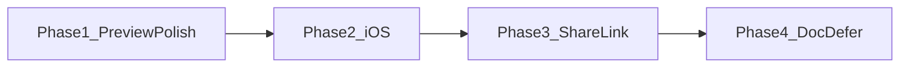
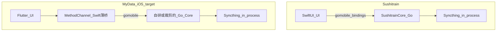
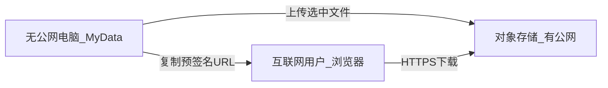

# MyData 路线图：预览 → iOS → 对外分享 → 文档

> 原 Cursor 计划文件在本机 `~/.cursor/plans/`，不随仓库同步。已归档到本路径，方便换机继续。  
> **进度（2026-08）**：Phase 1 / 3 / 4 主体已合入；Phase 2 仅有 iOS 脚手架与文档，真机 gomobile 引擎需在 **Mac** 上继续。

**概述**：预览 → iOS（sushitrain 式进程内 Syncthing）→ 对外分享用「上传云 + 临时链接」（S3 兼容）→ 文档仅系统打开。Syncthing 中继只解决「自己的设备」互通，不解决「给路人发链接」。

产品原则不变：轻量 Syncthing 客户端；不做原版 GUI 复刻。四阶段串行，前一阶段稳定后再开下一阶段。

---

## Phase 1：多媒体预览打磨（下一步主线）

目标：桌面 + Android「看文件」可靠、一致；大文件不 OOM；PDF/未知类型可打开。

### 1.1 大文件与预览传输（P0）

现状：[backend_server.dart](mydata_flutter/lib/core/backend/backend_server.dart) 用 `File.readAsBytes()` 整文件进内存；客户端 `previewFile` / peer 同样整包缓冲。

做法：
- 后端预览改为 `openRead` 流式响应；补全音视频 MIME（与 [file_types.dart](mydata_flutter/lib/shared/utils/file_types.dart) 对齐）
- 路径 canonicalize，拒绝逃出 folder root
- 客户端流式落盘，禁止大文件 `bodyBytes`；展示下载进度
- 超过阈值（建议 200MB）禁止应用内预览，提示「下载 / 系统打开」
- Peer：拉长超时、进度 UI、失败文案标明「需同网且对端 MyData 在线」；[media_file_opener.dart](mydata_flutter/lib/shared/utils/media_file_opener.dart) 临时文件在预览关闭后删除

### 1.2 PDF 与未知类型（P0）

- **Android**：未知类型与 PDF 用系统打开（`open_filex` 或等价）；不再只弹「类型+大小」
- **桌面**：保留系统打开；增加轻量应用内 PDF 只读（`pdfrx`），大 PDF 仍走系统打开
- 不把 Office 文档做成应用内渲染

### 1.3 图片手势与邻文件（P1）

- [image_preview_screen.dart](mydata_flutter/lib/features/folders/screens/image_preview_screen.dart) / 桌面 [file_preview_page.dart](mydata_flutter/lib/desktop/pages/file_preview_page.dart)：双击缩放、单击显隐工具栏
- 同目录图片左右滑切换（传入当前目录图片列表 + 索引）
- 桌面图片支持真全屏 overlay（Esc 退出）

### 1.4 预览入口统一（P1）

- 抽出共用「按扩展名分发」层，桌面 `FilePreviewPage` 与移动 `folder_detail_screen` 共用类型分支
- 移动文本从 `AlertDialog` 升为独立只读预览页（大文本截断提示）
- 视频沉浸全屏（横屏、隐藏系统栏）作为本阶段收尾，不做音频后台通知

### Phase 1 明确不做

语法高亮、SVG 专用引擎、Range 边下边播、相册式多选分享。

---

## Phase 2：iOS 兼容（受限 P2P）

前置：Phase 1 合入且桌面/Android 预览稳定。

定位：**前台可用** 的沙盒同步客户端，不对齐 Android 前台服务级常驻。

### 技术参考：sushitrain（强烈推荐）

[pixelspark/sushitrain](https://github.com/pixelspark/sushitrain)（MPL-2.0）已是成熟的 iOS/macOS Syncthing 客户端，架构与我们 Phase 2 目标一致：

**应参考（学架构，按需借鉴实现）**：
- **进程内节点**：`gomobile` 打出 `xcframework`，Swift 侧构造 `Client`，delegate 收回事件；禁止 Android 式子进程 `libsyncthing.so`
- **SushitrainCore 薄封装**：gomobile 不支持 slice 等复杂类型，用「字符串列表」等简单类型 wrap Syncthing API（见其 README Architecture / Discussion #144）
- **沙盒路径**：配置在 Application Support；同步文件夹放 Documents（Files App 可见）
- **后台尽力**：看其 BGTask / 生命周期处理，预期对齐「前台优先、后台尽力」
- **可选后续能力**（Phase 2 首版可不做，但文档记下）：selective sync（`.stignore` 的 `!/path` + `*`）、按需下载 + 本机 HTTP Range 流媒体

**不要整仓 fork / 照搬 UI**：
- 对方是 **SwiftUI 整应用**；MyData 保持 **Flutter UI + Dart shelf**，只借鉴 **Go Core 嵌入与桥接**
- 相册虚拟 FS（photo-fs）、Shortcuts、Continuity 等 Apple 深度集成首版不做
- 若直接复制其 MPL-2.0 源文件，需保留文件级版权与许可证声明；更稳妥是自写同构薄封装，仅对照其启动/`Client` 设计

**与现有 Android 关系**：Android 可继续用现有 jniLibs 子进程方案；iOS 走 sushitrain 式进程内库。长期若要统一，再评估两端都改为 in-process Client。

### 工作块

1. **引擎嵌入**：对照 SushitrainCore，用 gomobile 将 Syncthing 编为 iOS `xcframework`；Swift 薄桥对接 Flutter MethodChannel（禁止子进程）
2. **MethodChannel**：对齐现有 Android bootstrap / start / stop / config home（对照 [native_service.dart](mydata_flutter/lib/core/services/native_service.dart)）
3. **启动路径**：[main.dart](mydata_flutter/lib/main.dart) 纳入 iOS：启 Syncthing + shelf `:8443`；配置 Application Support，同步目录 Documents
4. **权限**：Info.plist 声明 Local Network、相机（扫码加设备）；Files App 可见同步目录
5. **文档**：AGENTS.md / README 写明「iOS 仅前台同步，后台尽力」及「引擎嵌入参考 sushitrain」；修正「已支持 iOS」的夸大表述

### Phase 2 明确不做

整仓 fork sushitrain、SwiftUI 重写、相册虚拟 FS、常驻后台对等 Android FGS、强推 App Store 上架（上架另开合规评估）。

---

## Phase 3：把文件分享给「互联网上的路人」（无公网固定 IP）

### 需求澄清

| 场景 | Syncthing 够不够 | 说明 |
|------|------------------|------|
| 自己的手机/另一台电脑访问家中文件 | 够（中继/直连） | 对方也要装 MyData/Syncthing，并互加设备 |
| **发给同事/客户一个链接，浏览器就能下** | **不够** | 对方没有 Device ID，也不会装同步客户端 |

无公网固定 IP 时，**浏览器可打开的链接**只能来自：有公网入口的第三方（云对象存储、临时隧道），或对方也走 P2P 工具。MyData 产品选定前者。

### 可选技术（评估后选定）

| 方案 | 对方体验 | 本机要公网 IP？ | 与 MyData 契合度 |
|------|----------|-----------------|------------------|
| **上传云盘 + 预签名/临时分享链接** | 浏览器打开即下 | 否 | **选定**：实现清晰、可控过期与流量 |
| Cloudflare Tunnel / frp / ngrok 暴露本机 HTTP | 浏览器可下，文件仍在本机 | 否（靠隧道） | 运维重、安全面大、App 内难产品化 |
| magic-wormhole / croc 类 | 对方装 CLI/工具 | 否（有中继） | 非浏览器用户，不适合「发链接」 |
| Syncthing 加对方为设备 | 对方必须装客户端 | 否 | 只适合熟人长期同步，不是「分享」 |

### 选定形态：S3 兼容「生成分享链接」

1. 用户在文件夹里选文件（或小目录打 zip）→「分享到互联网」
2. 后台用用户自配的 **S3 兼容**凭证上传到 bucket
3. 生成 **带过期时间的预签名 URL**（或厂商临时分享链），复制给对方
4. 过期后链接失效；本机可删远端对象

**厂商怎么选（应用不绑死一家）**：实现只认 **S3 兼容 API**，用户自填 endpoint。分享场景**流量费远大于存储费**，成本优先推荐 **七牛**；文档同时给阿里云/腾讯示例。

### 三家存储 / 下载成本对比（中国大陆，约 2025–2026 公开挂牌价，以官网为准）

上传（流入）三家一般 **免费**。计费大头是：**标准存储（元/GB/月）** + **外网下行/流出（元/GB）**。请求费通常可忽略。

| 厂商 | 标准存储（按量） | 外网下载流量（按量，分享链接走这条） | CDN 回源 | 个人向备注 |
|------|------------------|--------------------------------------|----------|------------|
| [七牛 Kodo](https://www.qiniu.com/prices/kodo) | ~0.115 元/GB/月（常有约 10GB/月免费） | **~0.26 元/GB**（>100TB 约 0.24） | ~0.15 元/GB（常有免费额度） | **下载最便宜**；适合「发临时链接」 |
| [腾讯云 COS](https://cloud.tencent.com/document/product/436/16871) | ~0.099 元/GB/月 | **~0.5 元/GB 起**（阶梯略降） | 常更低 / 可配 CDN | 存储略便宜；下载接近阿里忙时 |
| [阿里云 OSS](https://help.aliyun.com/zh/oss/traffic-fees) | ~0.09–0.12 元/GB/月（视冗余/地域） | **忙时 ~0.50 / 闲时 ~0.25 元/GB** | ~0.15 元/GB | 生态最全；白天分享贵一截 |

资源包粗算（第三方整理的「100GB 存储包 + 100GB 下行包」量级，活动价常变）：

| 厂商 | 约价（100GB 存 + 100GB 下） | 相对 |
|------|-----------------------------|------|
| 七牛 | ~38 元档 | 最省 |
| 腾讯 | ~43 元档 | 中 |
| 阿里 | ~60 元档 | 最贵 |

**场景估算（仅外网下载，忽略存储与请求）**：分享一个 **1GB** 文件、对方下一次：

- 七牛直链 ≈ **0.26 元**
- 阿里忙时 / 腾讯 ≈ **0.5 元**
- 阿里闲时（0–8 点）≈ **0.25 元**（接近七牛）

若链接被转发、下 10 次：费用 ×10。过期后删对象可停存储费，但已产生的下载费不退。

**产品建议（写入 Phase 3）**：
- 默认文档/引导：**七牛**（分享场景性价比最好）
- 已有阿里/腾讯账号：继续用，走同一套 S3 配置
- 高频下载：引导开 **CDN + 回源**（三家回源多在 ~0.15 元/GB），比直链外网流出便宜；首版可不强制接 CDN
- 有公网 VPS：自建 MinIO，流量成本≈机器带宽，无对象存储下行单价

首版范围：单文件 / 多文件打包上传、进度条、过期时长可选（如 1h / 1d / 7d）、复制链接、上传失败重试。不做：公开匿名全站网盘、应用内自建账号体系、默认暴露本机端口。

### Phase 3 明确不做

frp/ngrok 内置、把家中目录永久挂公网、用 Syncthing 冒充「给路人的下载链接」。

---

## Phase 4：文档「编辑」——刻意收缩

不做应用内 Office/Markdown 富编辑。

唯一交付：
- 文本/Office/PDF 等统一提供「用系统应用打开」
- 若用户在外部修改，依赖 Syncthing 正常扫描同步（已有手动扫描能力）

文档中写清：MyData 是同步与浏览，不是文档套件。

---

## 建议节奏

| 阶段 | 粗估 | 验收 |
|------|------|------|
| Phase 1 | 2–4 周 | 本机/peer 大图视频不崩；Android PDF 可外开；图片可滑切 |
| Phase 2 | 数周级 | iPhone 前台加设备、同步沙盒文件夹、浏览预览 |
| Phase 3 | 1–2 周 | 无公网电脑选文件 → 上传 S3（引导七牛）→ 预签名链接浏览器可下 |
| Phase 4 | 数日 | 入口齐全 + 文档声明，无编辑器代码 |

当前应立刻开工的是 **Phase 1**；「给互联网用户分享」排在 Phase 3，核心是 **云上传 + 临时链接**，不是 Syncthing 中继。
